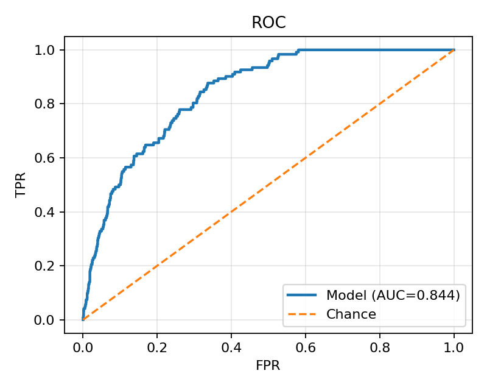
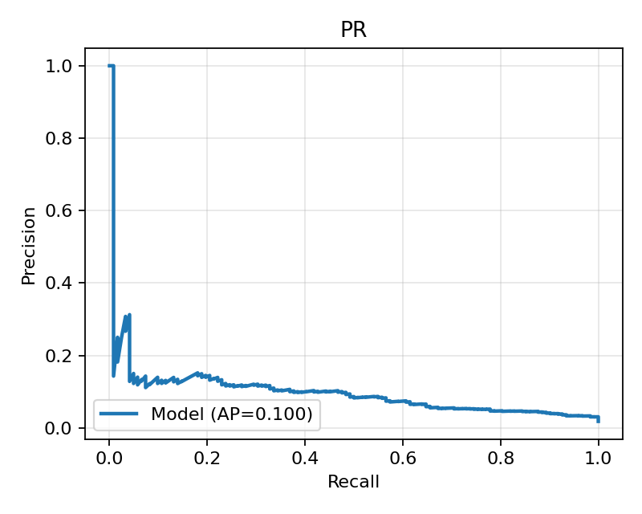

# COMP3070 Problem 9: ISIC-2020 Siamese Network to 0.8 accuracy
Author: Thomas Dunn UQ ID: s4693617

This repo trains a Siamese-style model (pretrained CNN backbone + projection head, L2-norm) using TripletLoss with in-batch semi-hard mining on the ISIC-2020 dataset for melanoma vs normal. The repo validates by prototype classification (class means in embedding space) with ROC-AUC / PR-AUC / ACC; threshold selected by max balanced accuracy. Supports TTA and multi-fold ensembling at inference. Throughout development I've employed smoke tests (tiny, fast) of each feature working towards thefull 5-fold runs and report aggregation and plots.

## Directory layout
s4693617_Siamese/  
├── dataset.py              # ISIC2020Dataset + PKSampler
├── modules.py              # SiameseEncoder (pretrained backbone + projection head)
├── losses.py               # TripletLoss (+ semi-hard mining)
├── train.py                # Training loop, validation, checkpointing, metrics, (safe) plots-at-end
├── predict.py              # Prototype-based inference; TTA; multi-ckpt ensembling
├── fold_runner.py          # Run all folds and aggregate metrics (CSV + summary)
├── utils.py                # Embedding/eval helpers; plotting (ROC/PR/training curves)
├── make_splits.py          # Patient-level stratified folds (K=5 by default)
├── build_train_csv.py      # Build minimal train.csv (image_name,target,patient_id) from ISIC csv
├── data/
│   └── splits/             # train_fold{k}.csv, val_fold{k}.csv (generated)
├── runs/                   # per-run artifacts (checkpoints, histories, logs, plots)
└── reports/                # folds.csv (per-fold + mean±std), summary.txt, ensemble predictions


## Environment
```bash
python3 -m venv .venv
source .venv/bin/activate
pip install --upgrade pip
pip install -r requirements.txt
```

## What is the model doing?
- We learn an embedding where images from the same class are close and different classes are far.
- We train with TripletLoss (anchor–positive–negative) using P×K batches (P classes, K images per class) so each batch supplies meaningful positives/negatives.
At validation/inference:
- Embed a labeled “support” set (e.g., the fold’s val split) and compute class prototypes (mean embeddings of benign/melanoma).
- For each image to predict, embed it and compute a score proportional to (distance to benign prototype − distance to melanoma prototype).
- Sweep thresholds to find the balanced-accuracy optimum; report AUC/AP/ACC.
- Optionally TTA (flip/rotate) to stabilize predictions.
- Optionally ensemble across fold checkpoints (average scores).

## Sample Batch grid
Generated from visualise_batch.py:

<p align="center">
  
</p>
<sub><em>Figure: 4×4 grid of augmented training images (patient-wise splits).</em></sub>

## Setup data
Download the ground truth, duplicate image list and metadata (v2) from the ISIC 2020 website, and put them in the raw folder. Then:
1. Build canonical train.csv: run python build_train_csv.py
2. Define the patient-level stratifed folds (k=5): run 
```
python make_splits.py \
  --train_csv data/raw/train.csv \
  --images_dir data/raw/train \
  --out_dir data/splits \
  --n_splits 5 --seed 1337
```
This gives leak safe training without a manual 75/10/15 split of training data.

## Final Training Command used
python fold_runner.py \
  --folds 5 \
  --splits_dir data/splits \
  --out_root runs/folds \
  --log_root runs/folds_logs \
  --reports_dir reports \
  --epochs 8 \
  --image_size 320 \
  --batch_p 8 --batch_k 4 \
  --val_batch 256 \
  --num_workers 6 \
  --scheduler onecycle --max_lr 1e-3 --backbone_lr_scale 0.25 --final_div_factor 1e3 \
  --head_lr 1e-3 --backbone_lr 1e-4 \
  --unfreeze_epoch 2 \
  --grad_clip 1.0 \
  --pretrained --freeze_backbone --amp \
  --early_stop --patience 3

Then run ensemble protection with TTA after folds finish:
python predict.py \
  --ckpt runs/folds/fold0/best.pt --support_csv data/splits/val_fold0.csv \
  --ckpt runs/folds/fold1/best.pt --support_csv data/splits/val_fold1.csv \
  --ckpt runs/folds/fold2/best.pt --support_csv data/splits/val_fold2.csv \
  --ckpt runs/folds/fold3/best.pt --support_csv data/splits/val_fold3.csv \
  --ckpt runs/folds/fold4/best.pt --support_csv data/splits/val_fold4.csv \
  --pred_csv data/splits/val_fold0.csv \
  --out_csv reports/ensemble_val_fold0.csv \
  --batch_size 256 --num_workers 6 \
  --tta

Artifacts per fold (in runs/folds/fold{k}/):
- best.pt — best checkpoint by val AUC
- training_history.json — loss & metric traces (+ LR groups)
- test_stats.txt — final evaluation summary (AUC/AP/ACC/threshold/class counts)
- train.log — with periodic CPU/GPU memory snapshots (To examine ensure no creeping GPU usage and crashes)

Make plots after training (saves time during training):
for k in 0 1 2 3 4; do
  python train.py \
    --fold $k --splits_dir data/splits \
    --out_dir runs/folds/fold$k \
    --epochs 0 --image_size 320 \
    --batch_p 8 --batch_k 4 --val_batch 256 --num_workers 6 \
    --plots_at_end
done

Per fold, get training_curves.png and val_roc.png, val_pr.png. Examples:



Note appears to be an issue with the training curve the final trainings, an example training curve attached in fold0 folder for ref from a smoke test (1 epoch).

## Results
Per fold metrics: see reports/folds.csv and reports/summary.txt
Using above run command, got final results of:

Folds summary: 
folds: 0..4 
AUC: 0.8697±0.0156 
AP : 0.1170±0.0290 
ACC: 0.7508±0.0487 
Total counts: neg=31698 pos=578 

Predict metrics:
val_auc=0.8913 
val_ap=0.1128 
val_acc@thr*=0.7210 
thr*=-0.019924


This is higher than most recent run results (as commited), likely due to X, but unfortunately due to time constraints while training, could not go back to using those parameters (each training plus predictions of the 5 folds took ~7 hours).

Future work to improve the model and push toward 0.8 accuracy includes bigger inputs (e.g., 384/448) if VRAM allows while monitoring overfitting, batch shape tuning (maintaining 32–64 images/step) and color constancy pre-processing (more inline with dermoscopy-specific robustness).

### Acknowledgements
ISIC 2020 data license applies to the dataset.

Siamese network: G. Koch, R. Zemel, R./ Salakhutdinov et al., "Siamese neural networks for one-shot image recognition," in ICML deep learning workshop, vol. 2. Lille, 2015, p. 0. 
